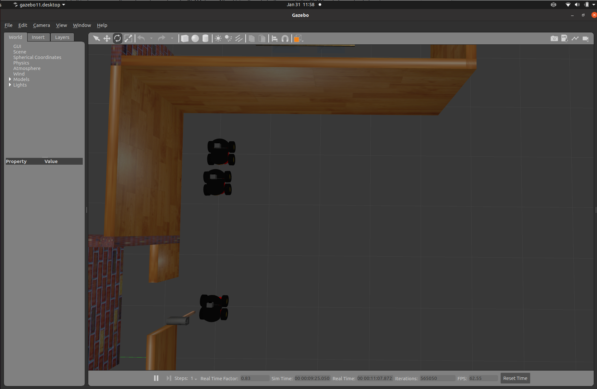

# RoboCup 2022 Rescue Simulation Virtual Robot League (RSVRL)

This year, the  <strong>rescue virtual robot league</strong> infrastructure is migrated to <strong>ROS 2 foxy-version</strong>. All sections and packages are undergoing major changes, and we will provide practical demos of each major challenge in the league to better understand the new infrastructure according to the following program:

    
| Type           | Task                                                        | Progress                                                 | 
| :---------:    | :-----------------:                                         | :----------------:                                   |
| P3AT Robot | Import Robot Models/Sensors to ROS2              |     |
| P3AT Robot | Multi-Robot Scenario  for ROS2                    |     |
| P3AT Robot | Single-Robot SLAM & Mapping Demo for ROS2        |      |
| Maps       | Import Former Maps to ROS 2                      |     |
| Wiki       | Wiki for Virtual Robot Community-Release 1             |        |
| P3AT Robot | Single-Robot Navigation Demo for ROS2            |        |
| P3AT Robot | Single-Robot Obstacle Avoidance tutorial for ROS2            |        |
| P3AT Robot | Single-Robot Advanced Obstacle Avoidance tutorial for ROS2            |        |
| P3AT Robot | Single-Robot Exploration Demo for ROS2           |        |
| P3AT Robot | Multi-Robot Map-Merge Demo for ROS2              |          |
| Wiki       | Wiki for Virtual Robot Community-Release 2             |        |
| Arial Robot| Import Robot Models/Sensors to ROS2             |          |
| Crawler Robot | Import Robot Models/Sensors to ROS2           |          |
| Wiki | Wiki for Virtual Robot Community-Release 3             |        |
    

## Requirements
The requirement for preparing the environment of virtual rescue robots are as follows:
- [Ubuntu 20.04 LTS Desktop](https://releases.ubuntu.com/20.04/)
- [ROS 2 Foxy Version](https://docs.ros.org/en/foxy/index.html)

## Installation
1. <strong> Download and Install Ubuntu on your PC </strong>
    1. Dowload the [Ubuntu 20.04 LTS Desktop](https://releases.ubuntu.com/20.04/) image.
    2. Install the Ubuntu 20.04 on your PC by the following instruction from [ this link ](https://ubuntu.com/tutorials/install-ubuntu-desktop#1-overview).

2. <strong> Install ROS 2 foxy version</strong> 
    
    Open a terminal console with Ctrl+Alt+T and enter the following commands one at a time. 
    ```
    sudo apt update && sudo apt install curl gnupg2 lsb-release
    sudo curl -sSL https://raw.githubusercontent.com/ros/rosdistro/master/ros.key  -o /usr/share/keyrings/ros-archive-keyring.gpg
    echo "deb [arch=$(dpkg --print-architecture) signed-by=/usr/share/keyrings/ros-archive-keyring.gpg] http://packages.ros.org/ros2/ubuntu $(lsb_release -cs) main" | sudo tee /etc/apt/sources.list.d/ros2.list > /dev/null
    sudo sed -i -e 's/ubuntu .* main/ubuntu focal main/g' /etc/apt/sources.list.d/ros2.list
    ```
    If the above installation fails, please refer to 
    [the official ROS2 Foxy installation guide.](https://index.ros.org/doc/ros2/Installation/Foxy/Linux-Install-Debians/)

3. <strong> Install Dependent ROS 2 Packages </strong>
    1. Open the terminal with Ctrl+Alt+T from Remote PC.
    2. Install Base Packages
    ```
    sudo apt update
    sudo apt install ros-foxy-desktop
    sudo apt install ros-foxy-ros-base
    sudo apt install python3-colcon-common-extensions

    ```
    3. Install Gazebo11
    ```
    sudo apt-get install ros-foxy-gazebo-*
    ```
    4. Install Cartographer
    ```
    sudo apt install ros-foxy-cartographer
    sudo apt install ros-foxy-cartographer-ros
    ```
    5. Install Navigation 2
    ```
    sudo apt install ros-foxy-navigation2
    sudo apt install ros-foxy-nav2-bringup
    ```
    6. Install Image view
    ```
    sudo apt install ros-foxy-rqt-image-view
     ```
    7. Add sourcing to your shell startup script by sourcing the setup.bash file 
    ```
    echo "source /opt/ros/foxy/setup.bash" >> ~/.bashrc
    source ~/.bashrc
    ```

4. <strong> Set up RoboCup2022RVRL_Demo project </strong>
    1. Clone RoboCup2022RVRL_Demo project into the your home directory
    ```
    cd ~
    sudo apt-get install git
    git clone https://github.com/RoboCup-RSVRL/RoboCup2022RVRL_Demo.git
    ```
    2. Build RoboCup2022RVRL_Demo project
    ```
    cd RoboCup2022RVRL_Demo
    source /opt/ros/foxy/setup.bash
    colcon build
    ```
    3. Add sourcing to RoboCup2022RVRL_Demo shell startup script by sourcing the setup.bash file 
    ```
    echo "source /home/{your username}/RoboCup2022RVRL_Demo/install/setup.bash" >> ~/.bashrc
    source ~/.bashrc
    ```
    
## Getting Started
<strong> For getting started, we launch a sample map with three robots (p3at) as following items: </strong>
1. Open a terminal console with Ctrl+Alt+T and launch the house_map world map
```
ros2 launch rvrl_gazebo house_map.launch.py
```
This should launch the following window:



As shown in this example, three robots are spawned in the environment, each of them can be controlled manually with the following procedure.
    
2. Open terminal 1 with Ctrl+Alt+T to drive the robot1 with following command:
```
ros2 run teleop_twist_keyboard teleop_twist_keyboard cmd_vel:=robot1/cmd_vel
```
3. Open terminal 2 with Ctrl+Alt+T to drive the robot2 with following command: 
```
ros2 run teleop_twist_keyboard teleop_twist_keyboard cmd_vel:=robot2/cmd_vel
```
4. Open terminal 3 with Ctrl+Alt+T to drive the robot3 with following command:
```
ros2 run teleop_twist_keyboard teleop_twist_keyboard cmd_vel:=robot3/cmd_vel
```
5. Open terminal 4 with Ctrl+Alt+T to get the robots image camera with following command:
```
ros2 run rqt_image_view rqt_image_view
```
In the window you could for instance select the depth camera of robot1:<br>


You can now drive the robot1 around with this view from terminal 1. First reduce the speed with command 'z', and start with moving to the front right with 'o'. Don't forget to stop before you hit the wall with 'k'.

You see that it is not easy to drive around on the image_view alone. To explore a larger area you need a map. A map can be generated with a Simultaneous Localization and Mapping algorithm (SLAM). Or you can let the robot drive around autonomously.

## Obstacle Avoidance tutorial

The P3AT has two sets of sonar sensors, 8 sonars at the front and 8 sonars at the back. See the next figure. Those sensors are notorious noisy, but have the benefit that they are mounted on the body of the robots. So the sonar sensors detect the body of the other robots, while the laserscanner mounted on top looks over the body and only detects the laserscanners on top of the other robots.


A simple obstacle avoidance behavior can be made, which detects if there is a obstacle in front, to the front-left or front-right. When there is an obstacle in front, it drives backwards. When there is an obstacle front-left or -right, it turns away. By adding a random component the robot has less change to get stuck.

This obstacle avoidance behavior can be found in the rvrl_tutorial directory. It can be started with the command:
```
python rvrl_tutorial/obstacle_avoidance_robot1.py
```
When this program is stopped with CTL-C, the robot continues to drive around in the last direction given. The movement can be stopped with the command:
```
python rvrl_tutorial/stop_robot1.py
```
**Tutorial assignment**: Add logic to prevent that the robot drives backwards when there is an obstacle at its back. The 8 sonar sensors emit beams like:


## Advanced Obstacle Avoidance tutorial

Although not perfect, the obstacle avoidance works quite reliable. Yet, robots can encounter difficult to evade obstacles. For instance, see the following situation:


The robot encounters a low table. You can recreate this situation with the command:
```
ros2 launch rvrl_gazebo before_table.launch.py
```
As you can see, the sonar beams (only so2 and so5 are visualized) are quite wide(opening angle of 16 degrees), but the range the report is an average value. In this case both sonar sensors report ~0.9m, above the collision threshold.

For the laserscanner the situation is even worse, because it the laser beams are emitted perfect horizontally (2D scan).


Even when you create a map of the room (see the SLAM section) only 4 tiny dots from the table legs are visible (and the shadows the cast on the map):


But luckily the P3AT model is equipped with a rs200 <a href=https://www.intelrealsense.com/ros/>Intel RealSense</a> camera. Camera devices have a wide field of view, so the table-top can be clearly seen from the start position:


This image can be seen from the viewer that you opened terminal 4 with the command:
```
ros2 run rqt_image_view rqt_image_view
```
The pixels in this image could be interpreted as depth in meters, although to the human eye the table-top in the foreground and the open space in the background look the same. Depth images can be converted into disparity images (the inverse of depth), which can be artificial coloured. With this artificial colouring the table top clearly stands out as nearby obstacle:


This disparity images can be generated when the following code is started:
```
python rvrl_tutorial/disparity_camera1.py
```
This code publishes the topic '/robot1/camera/depth/disparity_image', which can be displayed in following way.
Start the ros-visualisation tool rviz2 with the command: 
```
ros2 run rviz2 rviz2
```
In the lower left you can Add a display. Select a Image as display and assign ```/robot1/camera/depth/disparity_image``` as topic to this display.

As you can see, the disparity image with 5 red blocks, which can become green when no obstacle is detected in that direction.


**Tutorial assignment**: Add logic to prevent that the robot drives in the direction where an obstacle is seen in the depth image:

## SLAM Demo
1. In this demo, we use the cartographer package for SLAM demo. After driving the robots, then create the SLAM node for each robots using the following command:
```
ros2 launch rvrl_cartographer cartographer.launch.py robot_name:=robot1
```

Here you can change the robot_name:='robotname' to create different SLAM nodes for other robots.

2. Open rviz2 to visualize robot's map using the following command:
```
ros2 run rviz2 rviz2
```
In the lower left you can Add a display. Select a map as display type and assign ```/robot1/map``` as topic to this display.<br>


## Useful Links

* [Rescue Virtual Robot Wiki](https://robocup-rsvrl.github.io/)
* [RoboCup Federation Official Website](https://www.robocup.org/)
* [Virtual Robot League Official Website](https://rescuesim.robocup.org/competitions/virtual-robot-competition/)
* [Virtual Robot League in Robocup](https://www.robocup.org/leagues/27)
* [Official Website Robocup 2022](https://2022.robocup.org/)


